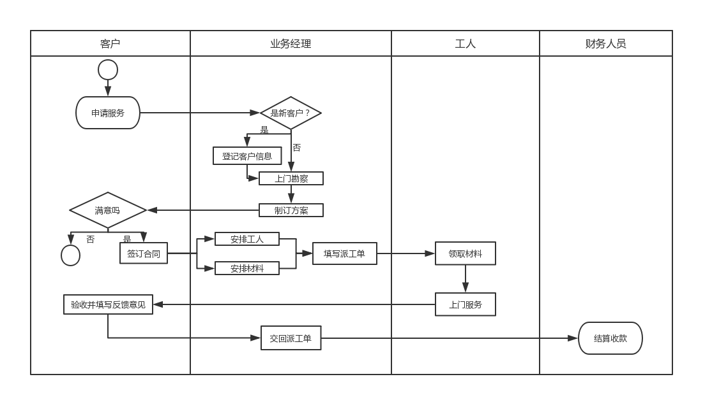

# 实验1：业务流程建模（老师示范）
|学号|班级|姓名|
|:-------:|:-------------: | :----------:|
|201610414305|软件(本)16-3|郭一家|

## 流程图1：考试及成绩管理流程

**业务流程图如下：**

**流程说明：**

期末考试前三周，教务处负责安排全校课程的考试时间和地点，下发“考试安排表”。考试前一周，认可教师准备好AB两份试卷，填写“试卷打印审
批表”一并教育系主任审批签字，将选中的期末试卷和已签字的“试卷打印审批表”送交教务处印刷部门进行印刷。学生按时到达指定考场参加考试，
考试完毕任课教师进行阅卷，产出成绩单，并对学生答卷装订存档。如果客串有不及格清空，教务处负责安排补考阅卷，并对学生答卷装订存档。
如果课程有不及格情况，教务处负责安排补考，流程结束。

## 流程图2： 客户维修服务流程

**业务流程图如下：**

**流程说明：**

流程从客户申请服务开始，如果是新客户，业务经理将改客户的基本信息记录下来。接下来业务经理将上门进行勘察，并制定具体“维修方案”。
业务经理和客户就方案进行沟通，如果达成一致，则签订正式“服务合同”，否则流程终结。根据合同方案，业务经理将对实施维修的人员和所需材料进
行计划，并填发“派工单”。工人拿到派工单后，领取指定材料上门实施服务。服务完成后客户进行验收，并在“派工单”上填写为偶像信息和反馈意见。
业务经理收回派工单后，同志财务人员进行项目结算并收款，流程结束