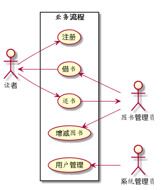

# 实验2：图书管理系统用例建模（老师示范）
|学号|班级|姓名|照片|
|:-------:|:-------------: | :----------:|
|201610414305|软件(本)16-3|郭一家|

## 1. 图书管理系统的用例关系图

### 1.1 用例图PlantUML源码如下：

``` usecase
@startuml
left to right direction
skinparam packageStyle rectangle
actor 读者
actor 图书管理员
actor 系统管理员
rectangle 业务流程 {
  读者 --> (注册)
  读者 <-- (借书)
  (借书) <-- 图书管理员 
    读者 --> (还书)
  (还书) --> 图书管理员 
  (增减图书) <-- 图书管理员
  (用户管理) <-- 系统管理员
}
@enduml
```

### 1.2. 用例图如下：



## 2. 参与者说明：

###     2.1 图书管理员

主要职责是：管理图书借还、图书增删

###     2.2 读者

主要职责是：注册账号，向图书管理员申请图书借还

###     2.3 系统管理员
    
主要职责是：管理图书管理员和读者的用户信息

##     3. 用例规约表

###     3.1 “注册”用例


###     3.2 “借书”用例


**“借书”用例流程图源码如下：**
``` uc1_flow
@startuml
start
:读者填写借书申请;
if(申请表信息是否正确？)then
    :将借书申请上传给图书管理员;
    if(图书是否有库存？)then
       :图书管理员向读者确认还书日期;
       :图书管理员确认借书;
       :系统上传借书信息;
    else
       :图书管理员向读者致歉说明没有库存;
    endif
else
    :系统提示表单错误重新进行填写;
endif
stop
@enduml
```

**“借书”用例流程图源码如下：**


###     3.3 “还书”用例


###     3.4 “增减图书”用例


###     3.5 “用户管理”用例


参见：表7.5