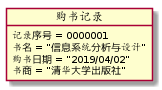

# 实验3：图书管理系统领域对象建模（老师示范）
|学号|班级|姓名|照片|
|:-------:|:-------------: | :----------:|:---:|
|12345678|软件(本)15-4|赵卫东||

## 1. 图书管理系统的类图

### 1.1 类图PlantUML源码如下：

``` class
@startuml
图书馆"1"*--"3..*"用户
图书馆"1"*--"1..*"图书
图书馆"1"*--"*"记录
用户 o-- 读者
用户 o-- 图书管理员
用户 o-- 系统管理员
记录 o-- 购书记录
记录 o-- 借书记录
记录 o-- 逾期记录
记录 o-- 用户更改记录
读者"1"-->"*"借书记录
读者"1"-->"*"逾期记录
图书管理员"1"-->"*"借书记录
图书管理员"1"-->"*"逾期记录
图书管理员"1"-->"*"购书记录
系统管理员"1"-->"*"用户更改记录
读者"*"--"1..*"图书
图书"1"-->"*"借书记录
图书"1"-->"*"逾期记录
图书"1"-->"1"购书记录
借书记录"1"--"0..1"逾期记录
class 图书馆{
int 图书馆编号
string 图书馆姓名
string 图书馆地址
}
class 用户{
string 用户账号
string 用户密码
string 用户权限
void 增加用户()
void 删除用户()
void 修改用户信息()
void 查询用户信息()
}
class 记录{
int 记录序号
string 记录种类
void 查询记录()
}
class 图书{
int 图书序号
string 书名
string 种类
int 售价
void 查询图书借阅记录()
void 查询图书购入记录()
}
class 读者{
string 用户账号
string 用户密码
string 真实姓名
void 借书()
void 还书()
void 查询借书记录()
void 查询逾期记录()
}
class 图书管理员{
string 用户账号
string 用户密码
string 真实姓名
void 查看图书概况()
void 购书()
void 审核借书申请()
}
class 系统管理员{
string 用户账号
string 用户密码
void 修改用户信息()
}
class 购书记录{
int 记录序号
string 书名
date 购书日期
string 书商
}
class 借书记录{
int 记录序号
string 借书人账号
string 借书人真实姓名
string 书名
string 批阅图书管理员姓名
date 借书日期
date 预定还书日期
foolean 是否逾期
void 检查是否逾期()
void 建立逾期记录()
}

class 逾期记录{
int 记录序号
string 书名
string 借书人账号
string 借书人真实姓名
string 批阅图书管理员姓名
date 借书日期
date 预定还书日期
date 实际还书日期
foolean 有无赔偿
}
class 用户更改记录{
int 记录序号
string 被修改用户账号
string 管理员账号
string 修改内容
date 修改日期
}
@enduml
```

### 1.2. 类图如下：


### 1.3. 类图说明：
1.图书馆由用户、图书和记录三部分组合而成。图书馆与这三部分是组成关系。
2.这三部分中的用户和记录，分别由其下级的“读者、图书管理员、系统管理员”和“购书记录、借书记录、逾期记录、用户修改记录”聚合而成。用户和记录分别与其下级为聚合关系。
3.一位读者可借阅多本图书，一本图书可被多位读者借阅。
4.一本图书可拥有多份被借阅和逾期归还的记录，但被购买的记录只有一份。
5.每次借书有可能发生最多一次逾期情况，每次发生逾期必然先进行借书。

## 2. 图书管理系统的对象图
### 2.1 类图书馆的对象图
#### 源码如下：
``` class
@startuml
object 图书馆{
图书馆编号 = 1008666
图书馆姓名 = "某某图书馆"
图书馆地址 = "某市某路666号"
}
@enduml
``` 
#### 对象图如下：


### 2.2 类用户的对象图
#### 源码如下：
``` class
@startuml
object 用户 {
用户账号 = "wangergou"
用户密码 = "weg123"
用户权限 = "读者"
}
@enduml
``` 
#### 对象图如下：


### 2.3 类记录的对象图
#### 源码如下：
``` class
@startuml
object 记录 {
记录序号 = 0000001
记录种类 = "购书记录"
}
@enduml
``` 
#### 对象图如下：


### 2.4 类图书的对象图
#### 源码如下：
``` class
@startuml
object 图书 {
图书序号 = 0000001
书名 = "信息系统分析与设计"
种类 = "信息技术"
售价 = 45
}
@enduml
``` 
#### 对象图如下：


### 2.5 类读者的对象图
#### 源码如下：
``` class
@startuml
object 读者 {
用户账号 = "wangergou"
用户密码 = "weg123"
真实姓名 = "王二狗"
}
@enduml
``` 
#### 对象图如下：


### 2.6 类用户的对象图
#### 源码如下：
``` class
@startuml
object 图书管理员 {
用户账号 = "cardinal"
用户密码 = "cardinal123"
真实姓名 = "卡迪那尔"
}
@enduml
``` 
#### 对象图如下：


### 2.7 类系统管理员的对象图
#### 源码如下：
``` class
@startuml
object 系统管理员 {
用户账号 = "system"
用户密码 = "114514"
}
@enduml
``` 
#### 对象图如下：


### 2.8 类购书记录的对象图
#### 源码如下：
``` class
@startuml
object 购书记录 {
记录序号 = 0000001
书名 = “信息系统分析与设计”
购书日期 = “2019/04/02”
书商 = “清华大学出版社”
}
@enduml
``` 
#### 对象图如下：


### 2.9 类借书记录的对象图
#### 源码如下：
``` class
@startuml
object 借书记录 {
记录序号 = 0100001
借书人账号 = "wangergou"
借书人真实姓名 ="王二狗"
书名 = “信息系统分析与设计”
批阅图书管理员姓名 = "卡迪那尔"
借书日期 = "2019/04/03"
预定还书日期 = "2019/04/10"
是否逾期 = true
}
@enduml
``` 
#### 对象图如下：


### 2.10 类逾期记录的对象图
#### 源码如下：
``` class
@startuml
object 逾期记录 {
记录序号 = 0200001
书名 = “信息系统分析与设计”
借书人账号 = "wangergou"
借书人真实姓名 = "王二狗"
批阅图书管理员姓名 = "卡迪那尔"
借书日期 = "2019/04/03"
预定还书日期 = "2019/04/10"
实际还书日期 = "2020/04/10"
有无赔偿 = true
}
@enduml
``` 
#### 对象图如下：


### 2.11 类用户修改记录的对象图
#### 源码如下：
``` class
@startuml
object 用户修改记录 {
记录序号 = 0300001
被修改用户账号 = "wangergou"
管理员账号 = "system"
修改内容 = "删除账号"
修改日期 = “2020/04/10”
}
@enduml
``` 
#### 对象图如下：
