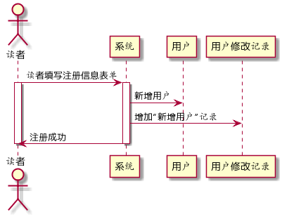
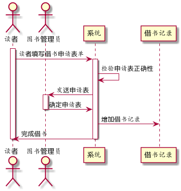
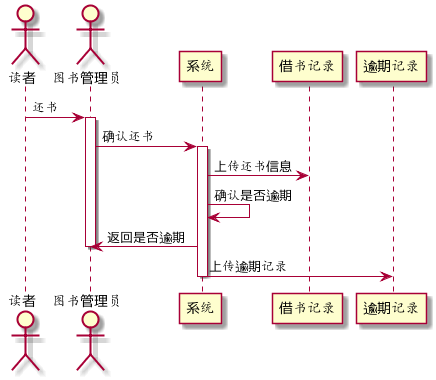
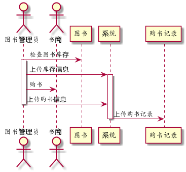
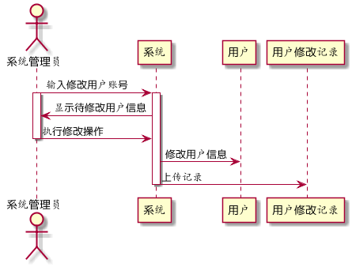

# 实验4：图书管理系统顺序图绘制
|学号|班级|姓名|
|:-------:|:-------------: | :----------:|
|201610414305|软件(本)16-3|郭一家|
## 图书管理系统的顺序图

## 1. 读者注册用例
## 1.1. 读者注册用例PlantUML源码

``` sequence
@startuml
actor 读者
读者 -> 系统:读者填写注册信息表单
activate 系统
activate 读者
系统 -> 用户:新增用户
系统 -> 用户修改记录:增加“新增用户”记录
系统 -> 读者:注册成功
deactivate 系统
deactivate 读者
@enduml
```

## 1.2. 读者注册用例顺序图


## 1.3. 读者注册用例顺序图说明
1.读者填写注册表单后上传给系统  
2.系统上传新注册的用户信息  
3.系统上传用户注册到用户修改记录  
4.系统返回注册结果  

***

## 2. 借书用例
## 2.1. 借书用例PlantUML源码

``` sequence
@startuml
actor 读者
actor 图书管理员

activate 读者
读者 -> 系统:读者填写借书申请表单
activate 系统

系统 -> 系统:检验申请表正确性
系统 -> 图书管理员:发送申请表
activate 图书管理员

图书管理员 -> 系统:确定申请表
deactivate 图书管理员
系统 -> 借书记录:增加借书记录
系统 -> 读者:完成借书
deactivate 系统
deactivate 读者
@enduml
```

## 2.2. 借书用例顺序图


## 2.3.借书用例顺序图说明
1.读者填写借书申请表并上传  
2.系统检验申请表格式  
3.系统将检验正确的申请表转发给图书管理员  
4.图书管理员确认借书  
5.系统上传借书记录  
6.读者成功借书  
***

## 3. 还书用例
## 3.1. 还书用例PlantUML源码

``` sequence
@startuml
actor 读者
actor 图书管理员
读者 -> 图书管理员:还书
activate 图书管理员
图书管理员 -> 系统:确认还书
activate 系统
系统 -> 借书记录:上传还书信息
系统 -> 系统 :确认是否逾期
系统 -> 图书管理员:返回是否逾期
deactivate 图书管理员
系统 -> 逾期记录:上传逾期记录
deactivate 系统
@enduml
```

## 3.2. 还书用例顺序图


## 3.3. 还书用例顺序图说明
1.读者还书给图书管理员  
2.图书管理员确认还书  
3.系统上传还书信息并检验是否逾期   
4.如果存在逾期，则通知图书管理员并上传逾期记录   
***

## 4. 购书用例
## 4.1. 购书用例PlantUML源码

``` sequence
@startuml
actor 图书管理员
actor 书商
图书管理员 -> 图书:检查图书库存
activate 图书管理员

图书管理员 -> 系统:上传库存信息
activate 系统
图书管理员 -> 书商:购书
图书管理员 -> 系统:上传购书信息
deactivate 图书管理员
系统 -> 购书记录:上传购书记录
deactivate 系统
@enduml
```

## 4.2. 购书用例顺序图


## 4.3. 购书用例顺序图说明
1.图书管理员检查图书库存  
2.图书管理员上传库存信息  
3.图书管理员根据图书库存情况向书商购书  
4.图书管理员上传购书信息  
5.系统上传购书记录  

***

## 5. 用户修改用例
## 5.1. 用户修改用例PlantUML源码

``` sequence
@startuml
actor 系统管理员
系统管理员 -> 系统:输入修改用户账号
activate 系统
activate 系统管理员
系统 -> 系统管理员:显示待修改用户信息
系统管理员 -> 系统 :执行修改操作
deactivate 系统管理员
系统 -> 用户:修改用户信息
系统 -> 用户修改记录:上传记录
deactivate 系统
@enduml
```

## 5.2. 用户修改用例顺序图


## 5.3. 用户修改用例顺序图说明
1.系统管理员输入要修改的用户账号  
2.系统返回待修改用户信息  
3.系统管理员确认执行修改操作  
4.系统修改用户信息  
5.系统上传用户修改记录  

***