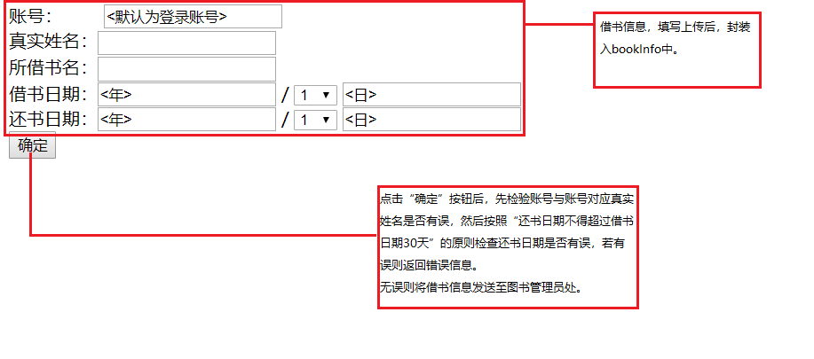

# 实验5：图书管理系统数据库设计与界面设计
|学号|班级|姓名|
|:-------:|:-------------: | :----------:|
|201610414305|软件(本)16-3|郭一家|

## 1.数据库表设计

## 1.1. 图书馆表
|字段|类型|主键，外键|可以为空|默认值|约束|说明|
|:-------:|:-------------:|:------:|:----:|:---:|:----:|:-----|
|Id|int|主键|否|||图书馆编号|
|Name|varchar2(100)| |否|||图书馆名|
|Addr|varchar2(100)| |否|||图书馆地址|

## 1.2. 用户表
|字段|类型|主键，外键|可以为空|默认值|约束|说明|
|:-------:|:-------------:|:------:|:----:|:---:|:----:|:-----|
|User|varchar2(100)||否|||用户账号|
|Pwd|varchar2(100)||否|||用户密码|
|Type|varchar2(100)||否|读者||用户权限|

## 1.3. 记录表
|字段|类型|主键，外键|可以为空|默认值|约束|说明|
|:-------:|:-------------:|:------:|:----:|:---:|:----:|:-----|
|Id|int|主键|否|||记录序号|
|type|varchar2(100)||否|||记录种类|

## 1.4. 图书表
|字段|类型|主键，外键|可以为空|默认值|约束|说明|
|:-------:|:-------------:|:------:|:----:|:---:|:----:|:-----|
|Id|int|主键|否|||图书序号|
|Name|varchar2(100)| |否|||书名|
|Type|varchar2(100)| |否|||种类|
|price|int||否|||售价|

## 1.5. 读者表
|字段|类型|主键，外键|可以为空|默认值|约束|说明|
|:-------:|:-------------:|:------:|:----:|:---:|:----:|:-----|
|User|varchar2(100)|外键|否|||用户账号|
|Pwd|varchar2(100)||否|||用户密码|
|Name|varchar2(100)| |否|||真实姓名|

## 1.6. 图书管理员表
|字段|类型|主键，外键|可以为空|默认值|约束|说明|
|:-------:|:-------------:|:------:|:----:|:---:|:----:|:-----|
|User|varchar2(100)|外键|否|||用户账号|
|Pwd|varchar2(100)| |否|||用户密码|
|Name|varchar2(100)| |否|||真实姓名|

## 1.7. 系统管理员表
|字段|类型|主键，外键|可以为空|默认值|约束|说明|
|:-------:|:-------------:|:------:|:----:|:---:|:----:|:-----|
|User|varchar2(100)|外键|否|||用户账号|
|Pwd|varchar2(100)| |否|||用户密码|

## 1.8. 购书记录表
|字段|类型|主键，外键|可以为空|默认值|约束|说明|
|:-------:|:-------------:|:------:|:----:|:---:|:----:|:-----|
|Id|int|主键|否|||记录序号|
|Name|varchar2(100)| |否|||书名|
|buy_date|date| |是|||购书日期|
|seller|varchar2(100)| |否|||书商|

## 1.9. 借书记录表
|字段|类型|主键，外键|可以为空|默认值|约束|说明|
|:-------:|:-------------:|:------:|:----:|:---:|:----:|:-----|
|Id|int|主键,外键|否|||记录序号|
|ReaderUser|varchar2(100)| |否|||借书人账号|
|ReaderName|varchar2(100)| |否|||借书人真实姓名|
|BookName|varchar2(100)| |否|||书名|
|ManagerName|varchar2(100)| |否|||批阅图书管理员姓名|
|Bdate|date| |否|||借书日期|
|Rdate|date| |否|||预定还书日期|
|IfOut|boolean| |是|||是否逾期|

## 1.10. 逾期记录表
|字段|类型|主键，外键|可以为空|默认值|约束|说明|
|:-------:|:-------------:|:------:|:----:|:---:|:----:|:-----|
|Id|int|主键,外键|否|||记录序号|
|BookName|varchar2(100)| |否|||书名|
|Memo|varchar2(100)| |是||||
|ReaderUser|varchar2(100)| |否|||借书人账号|
|ReaderName|varchar2(100)| |否|||借书人真实姓名|
|ManagerName|varchar2(100)| |否|||批阅图书管理员姓名|
|Bdate|date| |否|||借书日期|
|Rdate|date| |否|||预定还书日期|
|RealRdate|date| |否|||实际还书日期|
|IfCompensente|boolean| |否|||有无赔偿|

## 1.11. 用户修改记录表
|字段|类型|主键，外键|可以为空|默认值|约束|说明|
|:-------:|:-------------:|:------:|:----:|:---:|:----:|:-----|
|Id|int|主键,外键|否|||记录序号|
|User|varchar2(100)| |否|||被修改用户账号|
|AdminUser|varchar2(100)| |是|||管理员账号|
|Content|varchar2(100)| |否|注册用户||被修改用户账号|
|date|date| |否|||修改日期|
***

## 2. 界面设计
## 2.1. 借书界面设计

- 运行链接:[借书界面](https://github.com/HaurchefantGreystone/is_analysis/tree/master/test5/book.html)
- 用例图参见：借书用例
- 类图参见：借书记录类，读者类
- 顺序图参见：借书用例顺序图
- API接口如下：

1. sentBookForm

- 功能：发送申请
- 请求地址： http://[YOUR_DOMAIN]/api/library
- 请求方法：post
- 请求参数：

|参数名称|必填|说明|
|:-------:|:-------------: | :----------:|
|access_token|是|用于验证请求合法性的认证信息|
|bookInfo|是|封装的借书申请单信息 |
|method|是|固定为 “post”|

- 返回实例：
```
{
    "info": "借书申请提交完毕，请等待图书管理员确定",
    "code": 001
}
```
- 返回参数说明：
    
|参数名称|说明|
|:-------:|:-------------: |
|Info|返回信息|
|code|返回码|

 