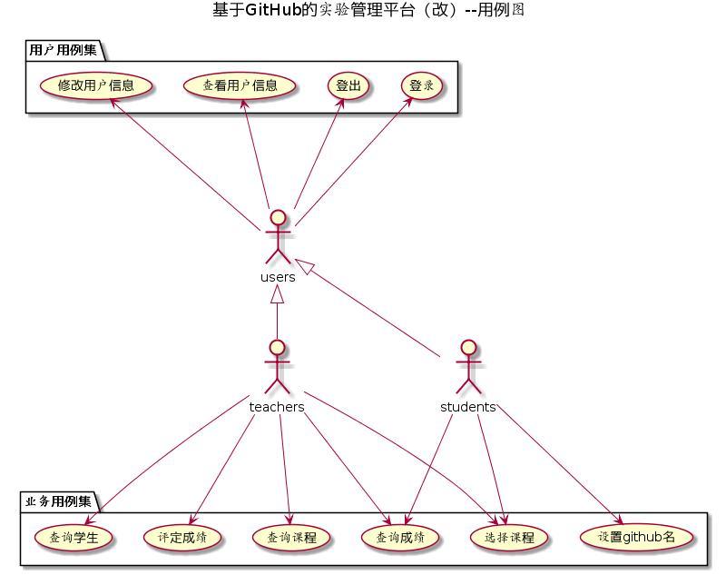
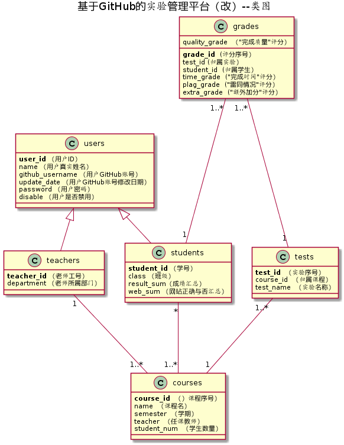

<!-- markdownlint-disable MD033-->
<!-- 禁止MD033类型的警告 https://www.npmjs.com/package/markdownlint -->

# 基于GitHub的实验管理平台的分析与设计

### 成都大学信息科学与工程学院

|学号|班级|姓名|照片|
|:-------:|:-------------:|:----------:|
|201610414305|软件(本)16-3|郭一家|

## 1. 概述
- 该实验管理平台是基于“基于GitHub的实验管理平台”，增加了学生选课、教师选课、多学期管理、单课程多项评分等功能的实验成绩管理平台。
- 学生的功能主要有：  
1.设置自己的GitHub用户名  
2.选择课程  
3.查询各课程的实验成绩  
注：学生的GitHub用户名是公开的，但成绩不公开。学生只能选择有任课老师的课程。  

- 老师的功能主要有：一是批改每个学生的成绩，二是查看每个学生的成绩。
1.选择成为课程的任课教师  
2.批改各课程参与学生的成绩  
3.查看各课程参与学生的成绩  
注：
1.老师需要先选择课程，成为该课程的任课教师后，才能激活该课程，使该课程出现在学生的选课列表中。  
2.老师批改学生成绩时，针对每次实验有“完成时间”、“完成质量”、“雷同情况”、“特别加分”四个评分项，老师根据这四个评分项给予学生适当的评分。四项评分之和为该学生本次实验的成绩。  
3.
- 老师和学生都能通过本系统的链接方便地跳转到学生的每个GitHUB实验目录，以便批改实验或者查看实验情况。
- 实验成绩按数字分数计算，每项实验的满分为100分，最低为0分。
- 系统自动计算每个学生的所有实验的平均分。
    
## 2. 系统总体结构

界面设计参见：https://haurchefantgreystone.github.io/is_analysis/test6/ui/index.html
    
## 3. 用例图设计 [源码](src/UseCase.puml)

## 4. 类图设计 [源码](src/class.puml)

## 5. 数据库设计
- ### [参见数据库设计](./数据库设计.md)

## 6. 用例及界面详细设计
- ### [“查看用户信息”用例](./用例/查看用户信息.md),[界面](https://haurchefantgreystone.github.io/is_analysis/test6/ui/showuser.html)
- ### [“修改用户信息”用例](./用例/修改用户信息.md),[界面](https://haurchefantgreystone.github.io/is_analysis/test6/ui/modifyusers.html)
- ### [“登录”用例](./用例/登录.md),[界面](https://haurchefantgreystone.github.io/is_analysis/test6/ui/login.html)
- ### [“登出”用例](./用例/登出.md),[界面](https://haurchefantgreystone.github.io/is_analysis/test6/ui/logout.html)
- ### [“学生列表”用例](./用例/学生列表.md),[界面](https://haurchefantgreystone.github.io/is_analysis/test6/ui/showstudents.html)
- ### [“查询成绩”用例](./用例/查询成绩.md),[界面](https://haurchefantgreystone.github.io/is_analysis/test6/ui/showgrades.html)
- ### [“评定成绩”用例](./用例/评定成绩.md),[界面](https://haurchefantgreystone.github.io/is_analysis/test6/ui/comment.html)
- ### [“查询课程”用例](./用例/查看课程.md),[界面](https://haurchefantgreystone.github.io/is_analysis/test6/ui/showcourse.html)
- ### [“教师选择课程”用例](./用例/教师选课.md),[界面](https://haurchefantGreystone.github.io/is_analysis/test6/ui/teacherchoose.html)
- ### [“学生选择课程”用例](./用例/学生选课.md),[界面](https://haurchefantGreystone.github.io/is_analysis/test6/ui/studentschoose.html)