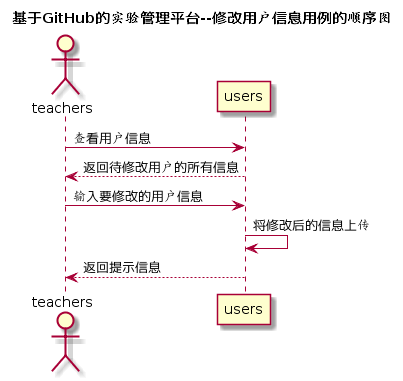

<!-- markdownlint-disable MD033-->
<!-- 禁止MD033类型的警告 https://www.npmjs.com/package/markdownlint -->

# “修改用户信息”用例 [返回](../README.md)
## 1. 用例规约

|用例名称|修改用户信息|
|-------|:-------------|
|功能|修改用户的各种信息|
|参与者|老师|
|前置条件|教师以教师身份账号登录|
|后置条件| |
|主事件流| 1.用户点击想要修改的用户   2.用户提交修改信息  3.系统上传修改后的用户信息|
|备选事件流|1a. 如果用户修改信息存在错误  &nbsp;&nbsp; 1.返回错误信息，提示重新提交修改信息|

## 2. 业务流程（顺序图） [源码](../src/sequence修改用户信息.puml)
 

## 3. 界面设计
- 界面参照: https://zwdbox.github.io/is_analysis/test6/ui/modifyUsers.html
- API接口调用
    - 接口1：[getUserInfo](../接口/getUserInfo.md)
    - 接口2：[setUserInfo](../接口/setUserInfo.md)
    
## 4. 算法描述
无
    
## 5. 参照表
- [USERS](../数据库设计.md/#USERS)
