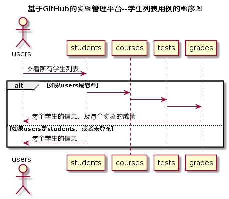

<!-- markdownlint-disable MD033-->
<!-- 禁止MD033类型的警告 https://www.npmjs.com/package/markdownlint -->

# “学生列表”用例 [返回](../README.md)
## 1. 用例规约

|用例名称|学生列表|
|-------|:-------------|
|功能|以表形式的显示出所有学生的信息|
|参与者|学生，老师|
|前置条件|学生，老师需要先登录|
|后置条件| |
|主事件流| 1.系统判断用户的身份  2.如果用户是教师则返回所有学生的信息和成绩  |
|备选事件流|2.如果用户是学生  2a.只返回学生信息而不显示成绩|

## 2. 业务流程（顺序图） [源码](../src/sequence学生列表.puml)
 

## 3. 界面设计
- 界面参照: https://haurchefantgreystone.github.io/is_analysis/test6/ui/showStudents.html
- API接口调用
    - 接口1：[getStudents](../接口/getStudents.md) 

## 4. 算法描述

- WEB_SUM解析为列表  
  - WEB_SUM是接口getStudents的返回值中的一部分，形如："WEB_SUM": "Y,Y,Y,Y,Y,N"。需要在前端进行解析。  
  - 作用是判断GitHub网址是否正确，用逗号分开，Y代表正确，N代表不正确。  
  - 第1位代表总的GitHUB地址是否正确，第2位表示第1次实验的地址，第3位表示第2位实验地址，依此类推。
  - 比如：“Y,Y,Y,Y,Y,N”表示第5次实验地址不正确，其他地址正确。  
  - 算法是使用使用字符串分离方法将其分开。

- RESULT_SUM解析为列表
    - RESULT_SUM是接口getStudents的返回值中的一部分，形如："RESULT_SUM": "81.25,70,80,85,90,N"。需要在前端进行解析。
    - 成绩汇总（来自GRADES表），以逗号分开，第一个成绩是平均成绩,后面是每次实验的实验总成绩，并在括号内表示该次实验的每项评分情况，其格式为：（“完成时间评分”，“完成质量评分”，“雷同情况评分”，“特别加分评分”） ,N表示未批改，平均分只计算已批改的。
    - 比如：比如：“55，60（10，40，0，10），0（10，80，-90，0），80（10，60，0，10），80（10，60，0，10），N”表示一共批改了4次，第5次未批改，4次的成绩分别是60，0，80，80，4次的平均分是81.25。
    - 算法是使用使用字符串分离方法将其分开。
    
## 5. 参照表

- [STUDENTS](../数据库设计.md/#STUDENTS)
- [GRADES](../数据库设计.md/#GRADES)
- [TESTS](../数据库设计.md/#TESTS)

